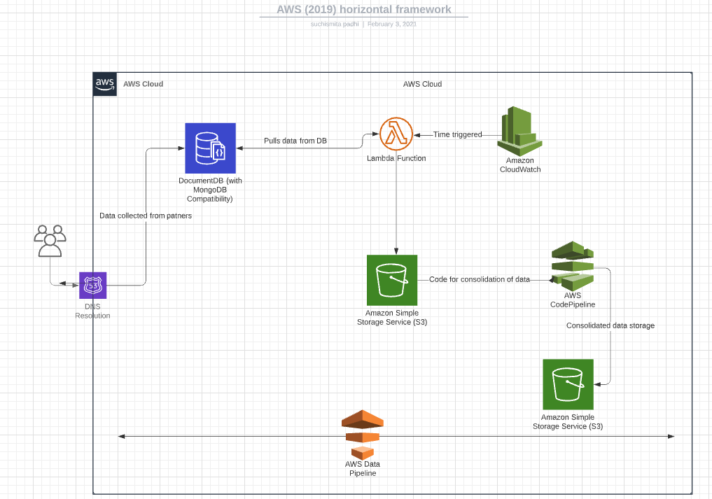

## 1.The figure here mentions the approch that picks up records from partners and consolidates them.

## 2. The following design is an example of AWS Data pipeline using Lambda function, A cloud watch to trigger the function and S3 bucket for storage and an extrenal data storage for files.

## 3. In order to orchestrate the pipeline services from AWS such as Cloudwatch can be used or the better solution can be using a container orchestration platform such as Kebernetes which handles all buil, deploy and scalability issues by itself.

## 4. Clous conponents that i have choosen are :
[AWS Lambda](as it handles and scales the server very efficient and cost effectively)
[S3 bucket](goes well with lambda fuctions and provides better security across the platforms)
[cloudwatch](auto monitoring and optimisation of resources is provided)

## 5. The se component can be triggered from Cloudwatch whenever a document is loaded in mongoDb by partners and hence the process continues with this single trigger of document upload in db.

## 6. In order to monitor the pipeline we can use the codepipeline console or can keep a track with an endpoint.

## 7. Deploying the code can go through the CI/CD process provided in AWS which requires a manual approval of the code before deployment and should pass all the checks. 

